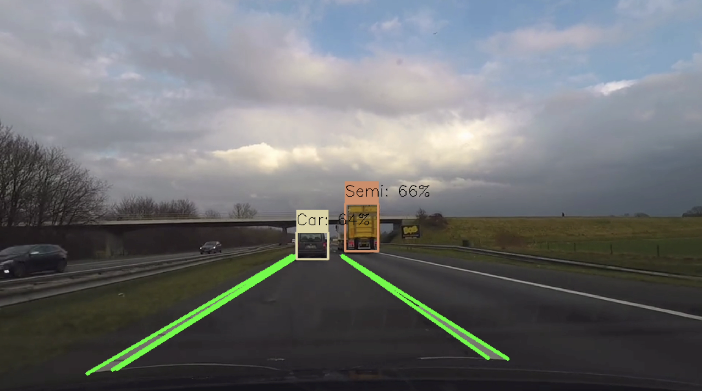
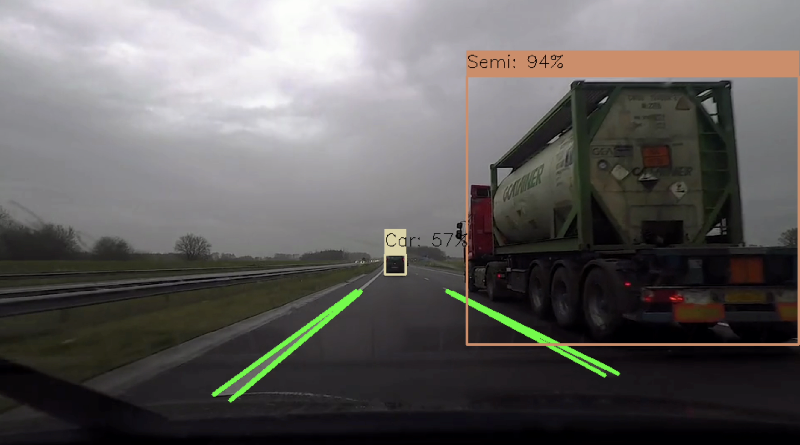

# advanced-driver-assistance-system

Built utilizing only computer vision, this advanced driver assistance system is capable of detecting road lanes and can detect six different objects:
- People
- Cars
- Trucks
- Semi-trucks
- Stop signs
- Speed limit signs

This project was built using a variety of libraries, with the most notable ones being OpenCV and NumPy. Object detection is done using a custom trained [YOLOv5](https://github.com/ultralytics/yolov5) computer vision model. Lane detection is accomplished through the use of Hough Line Transform with OpenCV. I plan to expand upon this project further in the future, adding features such as a display for showing detected objects on a user interface, and distance calculation to show how far ahead detected objects are from the driver.

## Dataset Citations:
1. [Stanford Car Dataset](https://www.kaggle.com/datasets/jessicali9530/stanford-cars-dataset)
2. [Traffic Light Dataset](https://github.com/Thinklab-SJTU/S2TLD?tab=readme-ov-file) (Pre-annotated; not annotated by me)
3. [UK Trucks Dataset](https://www.kaggle.com/datasets/bignosethethird/uk-truck-brands-dataset?select=UKTrucksDataset.1005)
4. [D2-City Dashcam Footage Dataset](https://www.scidb.cn/en/detail?dataSetId=804399692560465920)
